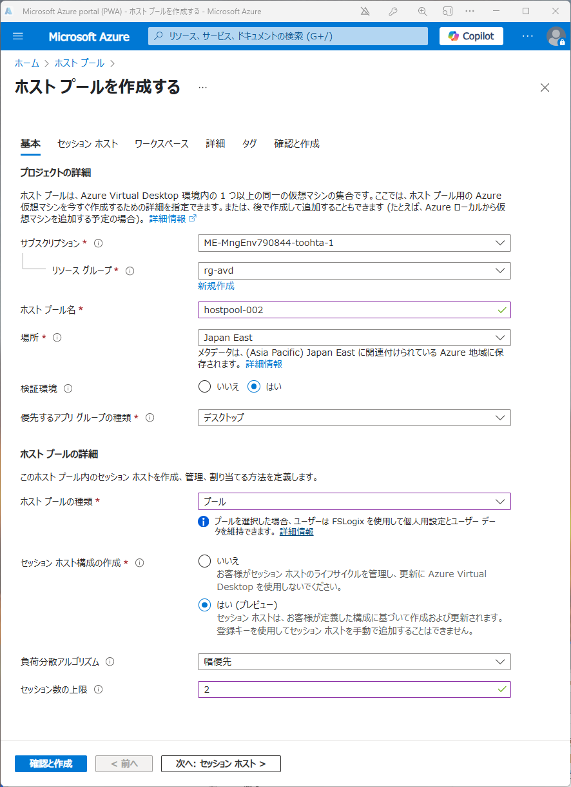
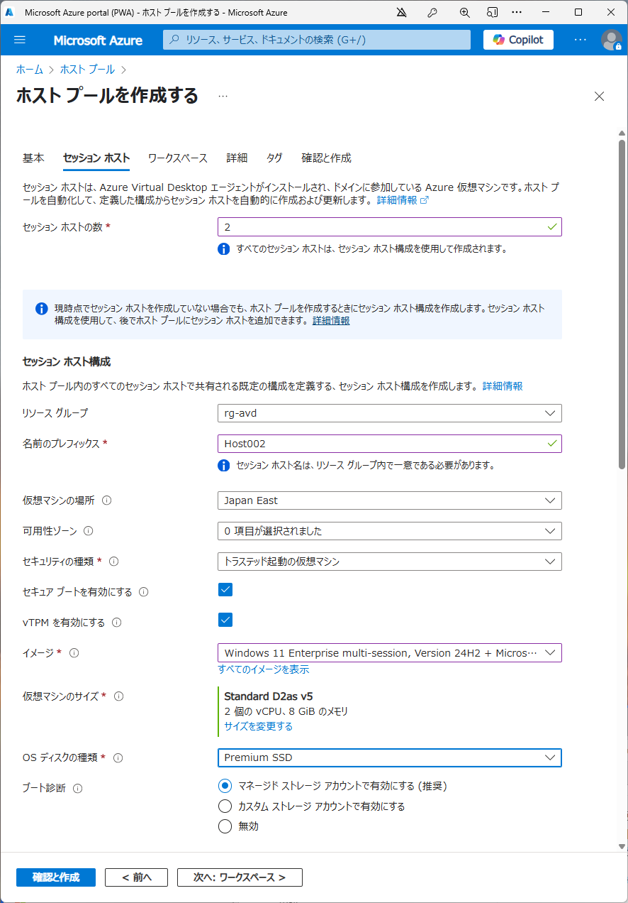
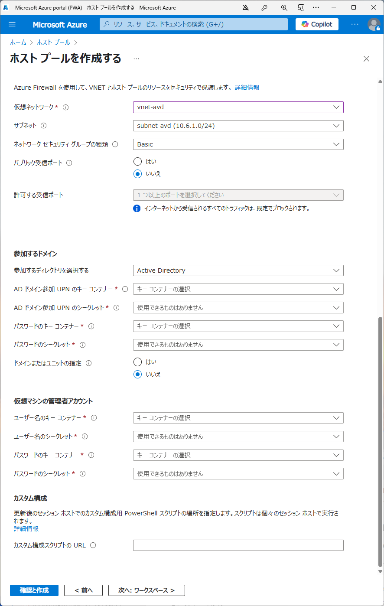

# Azure Virtual Desktop セッションホスト構成管理（Session Host Configuration）アプローチでの構成手順（Entra ID 参加セッションホスト向け）

AVDの「ホスト構成管理アプローチ」は、セッションホストの構成やアプリ配布、設定管理を一元的に自動化・標準化する方法です。Entra ID 参加セッションホストを前提とした標準的な構成手順をまとめます。
参考：[Azure Virtual Desktop をデプロイする](https://learn.microsoft.com/ja-jp/azure/virtual-desktop/deploy-azure-virtual-desktop?tabs=portal-session-host-configuration%2Cportal-standard%2Cportal&pivots=host-pool-session-host-configuration)

## 1. 前提条件
- Azure サブスクリプション
- Azure Active Directory (Entra ID)
- 仮想ネットワーク（VNet）
- Entra ID 参加用の設定（必要に応じてデバイス登録・Intune設定など）

## 2. ネットワーク準備
- AVD 用のサブネットを作成
- （省略）必要に応じて VPN/ExpressRoute でオンプレミスと接続
- （省略）DNS 設定（Entra ID 参加の場合はAzure提供DNSでOK、オンプレAD不要）

## 3. Entra ID 構成
- ユーザー/グループの準備（Entra ID上で管理）
- ユーザー/グループにロール割り当て
  - 管理ユーザー向けに
    - デスクトップ仮想化共同作成者、仮想マシン共同作成者 など
  - （Entra 参加ホストプールの場合）利用者向け に
    - 仮想マシンユーザーログイン、仮想マシン管理者ログイン など
  - AVDサービスプリンシパルに
    - デスクトップ仮想化共同作成者
- （省略）必要に応じてIntune等のデバイス管理設定
- 参考：[ホスト プールにユーザー アクセスを割り当てる](https://learn.microsoft.com/ja-jp/azure/virtual-desktop/azure-ad-joined-session-hosts#assign-user-access-to-host-pools)

## 4. AVD ホストプール作成
セッション ホストを参加させることができる Active Directory ドメインが必要。Microsoft Entra ID へのセッション ホストの参加はサポートされていませんが、Microsoft Entra ハイブリッド参加を使用できます。

以下の様なイメージで、
  
  
  
キーコンテナーの指定が必要で、ここが大きく異なる点。
キーコンテナーは、ホストの管理者アカウントの資格情報を格納するために使用されます。

## 9. クライアント設定
- AVDクライアント配布・接続案内
- Entra ID認証でのサインイン

## 10. 運用・セキュリティベストプラクティス
- 多要素認証（MFA）有効化
- 条件付きアクセス
- Intuneによるデバイス管理・監査
- Azure Monitor/Log Analyticsによる監視
- 自動スケーリング・バックアップ

## 参考ドキュメント
- [AVD: セッションホストの構成管理](https://learn.microsoft.com/ja-jp/azure/virtual-desktop/configure-host-pool-manage-session-hosts)
- [Entra ID 参加セッションホスト](https://learn.microsoft.com/ja-jp/azure/virtual-desktop/azure-ad-joined-session-hosts)
- [IntuneによるWindows管理](https://learn.microsoft.com/ja-jp/mem/intune/fundamentals/what-is-intune)

---

> **注意:** 本手順はEntra ID 参加＋Intune管理を前提とした標準例です。要件やセキュリティポリシーに応じて調整してください。

