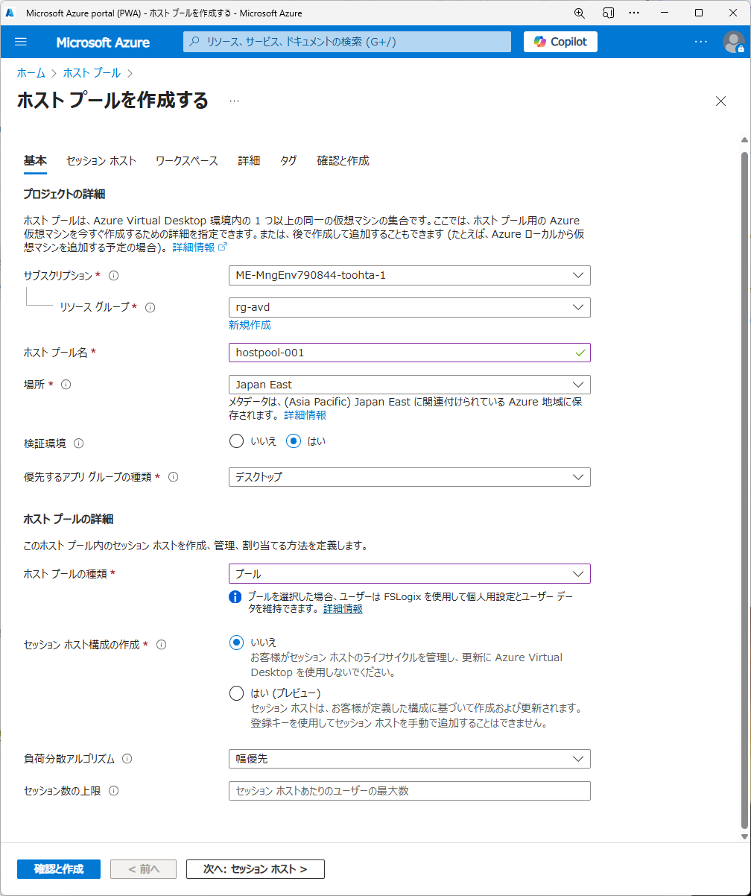
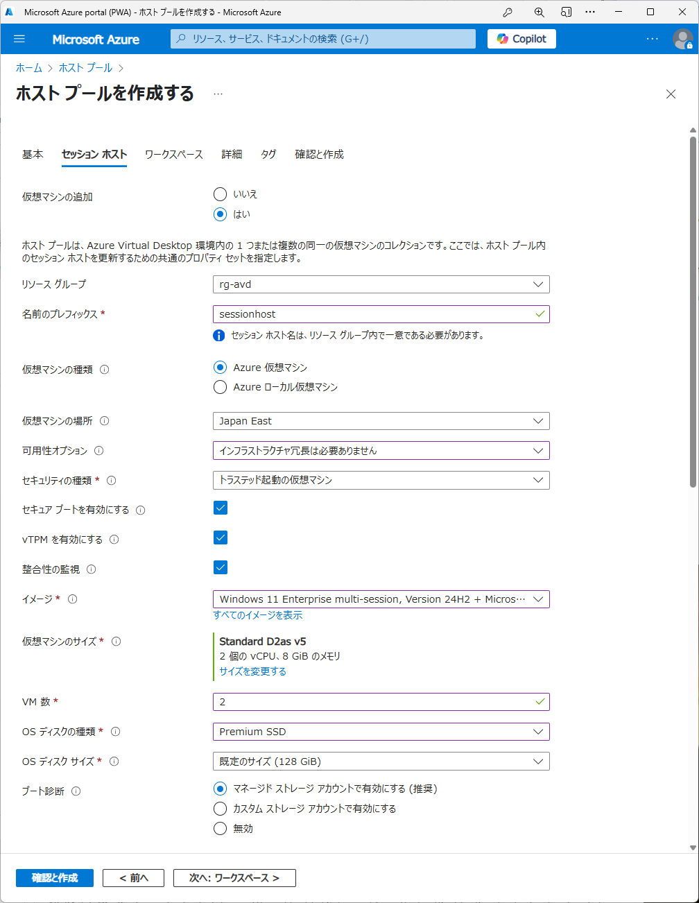
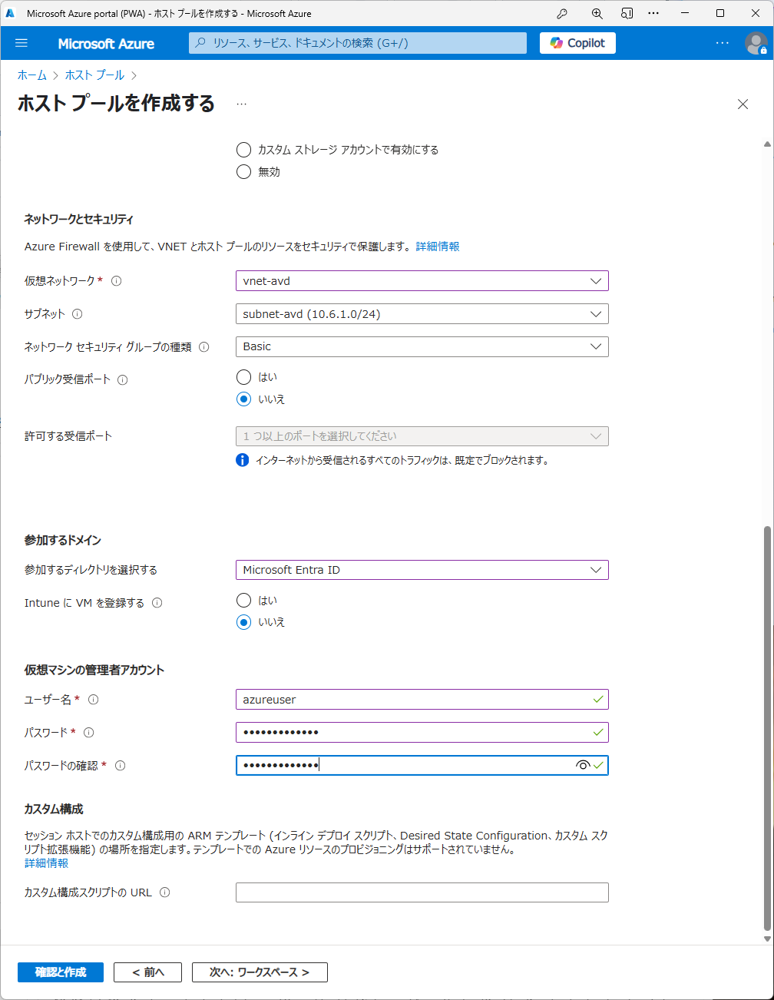
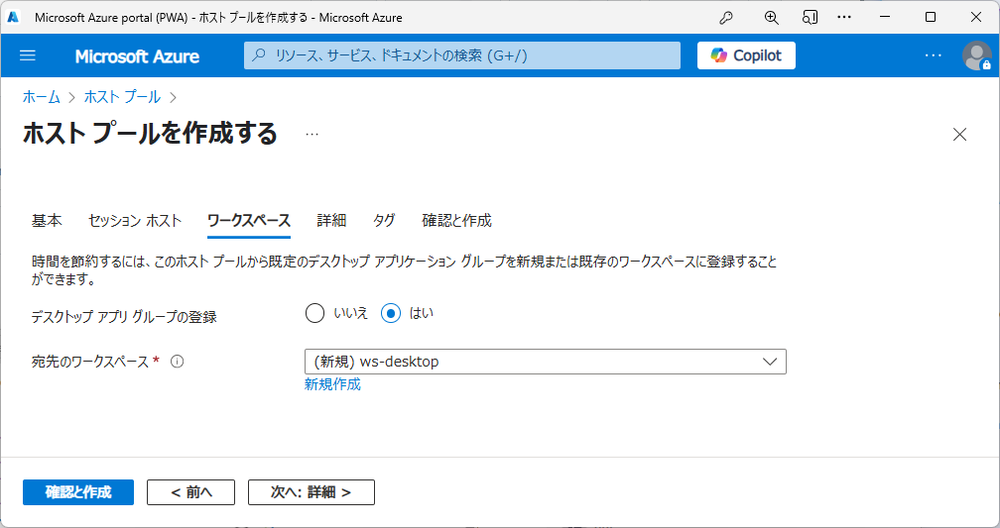
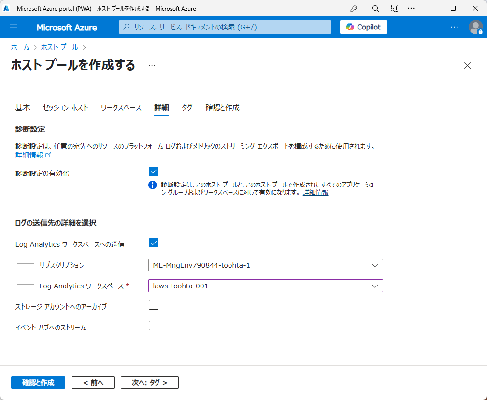
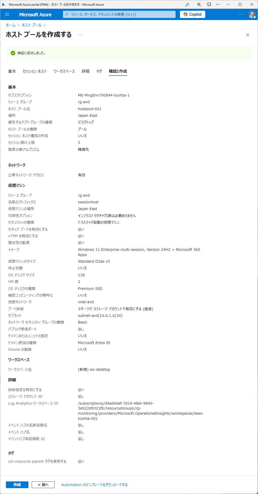

# Azure Virtual Desktop 標準構成管理（Standard Management）での構成手順（Entra ID 参加セッションホスト向け）

Azure Virtual Desktop (AVD) の標準的な構築手順（セッションホストがEntra ID（Azure AD）参加の場合）を以下にまとめます。セキュリティや運用のベストプラクティスも考慮しています。

## 1. 前提条件
- Azure サブスクリプション
- Azure Active Directory (Entra ID)
- 仮想ネットワーク（VNet）
- Entra ID 参加用の設定（必要に応じてデバイス登録・Intune設定など）

## 2. ネットワーク準備
- AVD 用のサブネットを作成
- （省略）必要に応じて VPN/ExpressRoute でオンプレミスと接続
- （省略）DNS 設定（Entra ID 参加の場合はAzure提供DNSでOK、オンプレAD不要）

## 3. Entra ID 構成
- ユーザー/グループの準備（Entra ID上で管理）
- ユーザー/グループにロール割り当て
  - 管理ユーザー向けに
    - デスクトップ仮想化共同作成者 など
  - （Entra 参加ホストプールの場合）利用者向け に
    - 仮想マシンユーザーログイン、仮想マシン管理者ログイン など
  - 「Virtual Machine Administrator Login」ロール
- （省略）必要に応じてIntune等のデバイス管理設定
- 参考：[ホスト プールにユーザー アクセスを割り当てる](https://learn.microsoft.com/ja-jp/azure/virtual-desktop/azure-ad-joined-session-hosts#assign-user-access-to-host-pools)

## 4. ホストプールの作成
- Azure Portal で「ホストプール」を作成
  - 種別: Pooled（共有）または Personal（専有）
  - 最大セッション数などの設定
  - 以下のウィザードを使用してホストプール、セッションホスト、アプリケーショングループ、ワークスペース作成まで行える
    
    
    
    
    
    

## 5. 仮想マシン（セッションホスト）のデプロイ
- イメージ選択（Windows 11/10 マルチセッション Entra ID 参加対応イメージ推奨）
- VM サイズ・台数の選定
- Entra ID 参加を有効化（ドメイン参加は不要）
- ネットワーク/ストレージ設定
- （省略）必要に応じてIntune自動登録設定

## 6. アプリケーショングループの作成
- デスクトップ/RemoteApp グループ作成
- 必要なアプリケーションのインストール

## 7. ユーザー割り当て
- アプリケーショングループにユーザー/グループを割り当て（Entra IDユーザー）

## 8. クライアント設定
- AVD クライアントの配布（Windows, macOS, Web, iOS, Android）
- ユーザーへ接続情報を案内
- Entra ID認証でのサインインを案内

## 9. セキュリティ・運用ベストプラクティス
- 多要素認証（MFA）の有効化
- 条件付きアクセスの設定
- ログ監視（Azure Monitor, Log Analytics）
- 自動スケーリングの設定
- バックアップ/更新管理
- Intuneによるデバイス管理（推奨）

## 10. 参考ドキュメント
- [公式ドキュメント: Azure Virtual Desktop](https://learn.microsoft.com/ja-jp/azure/virtual-desktop/)
- [Entra ID 参加セッションホストの構成](https://learn.microsoft.com/ja-jp/azure/virtual-desktop/azure-ad-joined-session-hosts)
- [セキュリティ ベストプラクティス](https://learn.microsoft.com/ja-jp/azure/virtual-desktop/security-guide)

---

> **注意:** 本手順はEntra ID 参加セッションホスト向けの標準構成例です。要件やセキュリティポリシーに応じて適宜調整してください。
